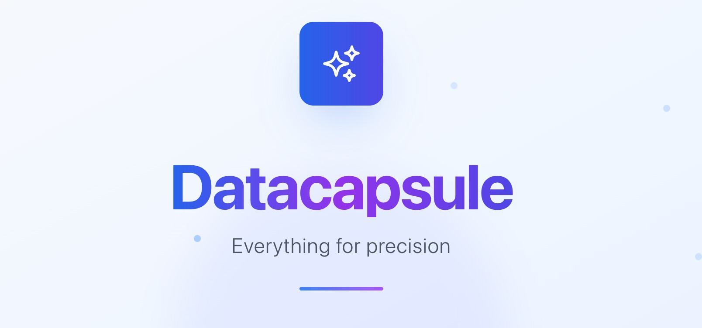
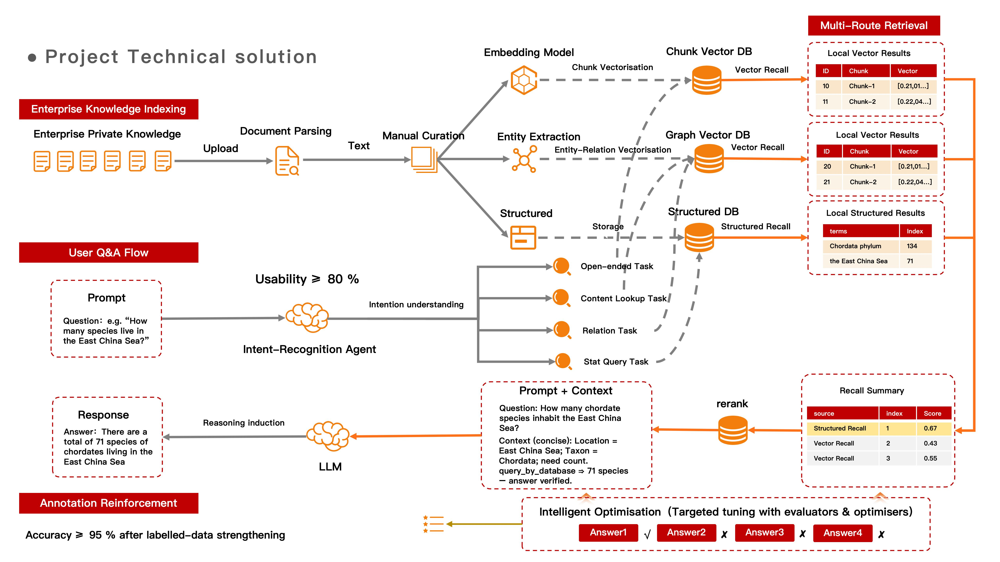
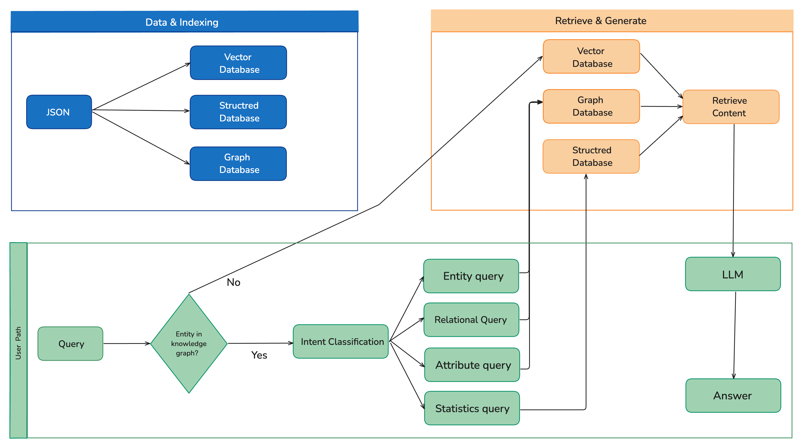
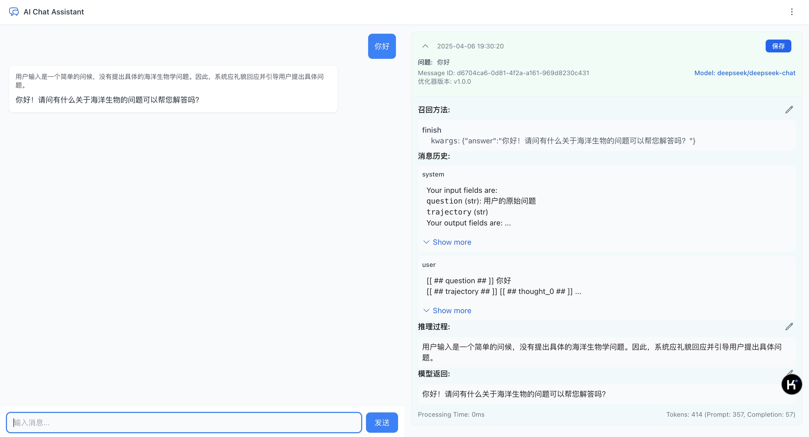
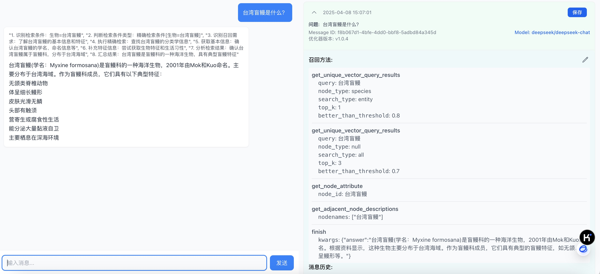
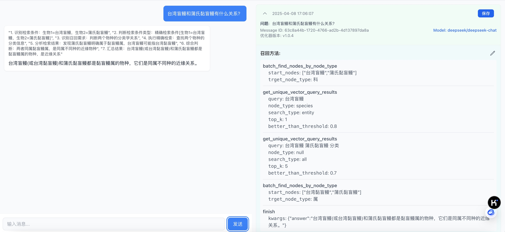
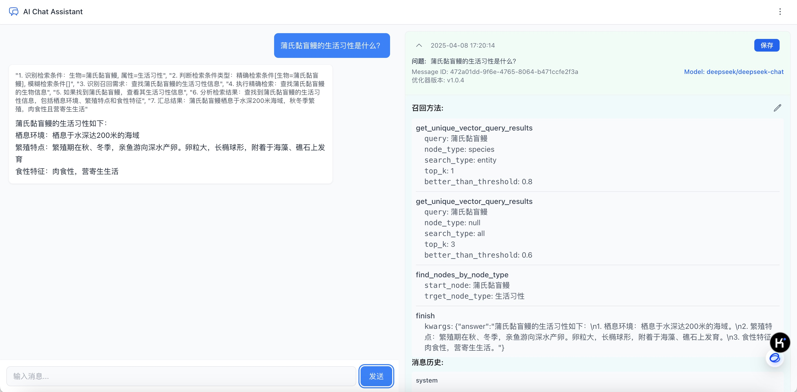
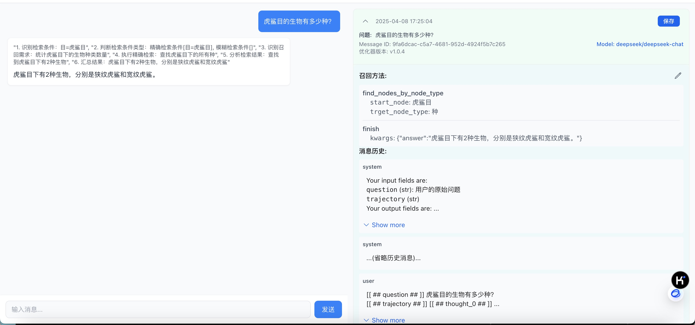

<div align="center">
  
  <h1>✨ Datacapsule</h1>
  <p><strong>Everything for precision</strong></p>
  <p>A knowledge graph-based multi-path retrieval solution for intelligent information extraction and Q&A</p>
</div>

<div align="center">
  
  
  
  
  
  
  <br>
  
  
  
  
  

  <br>

  <a href="./readme.md"></a>
  <a href="https://github.com/loukie7/Datacapsule/blob/main/readme_en.md"></a>

  <br>

  <a href="https://github.com/loukie7/Datacapsule-webui">📱 Frontend Repository</a> •
  <a href="https://github.com/loukie7/Datacapsule/wiki">📚 Documentation</a> •
  <a href="https://github.com/loukie7/Datacapsule/issues">💬 Discussions</a>

</div>

---

## 🚀 Technology Solution


## 🚀 Overview

Datacapsule is an advanced knowledge graph-based multi-path retrieval solution that combines the power of graph databases, vector search, and intelligent reasoning to deliver precise information retrieval and question-answering capabilities. The system intelligently routes queries through multiple retrieval paths - vector search, graph traversal, and structured database queries - to provide comprehensive and accurate responses.

### 🌟 Key Features

- **🔍 Multi-path Retrieval**: Intelligent routing between vector search, graph traversal, and SQL queries
- **🧠 Smart Question Understanding**: Automatically classifies queries into entity, relationship, attribute, and statistical questions
- **📊 Knowledge Graph Management**: Dynamic graph construction and visualization with NetworkX
- **⚡ Lightweight Vector Database**: Built-in NanoVector for efficient semantic search
- **🔄 Real-time Communication**: SSE (Server-Sent Events) for streaming responses
- **🎯 Mini-React Framework**: Lightweight intelligent reasoning scheduler
- **🌐 Modern Frontend**: React 18 + Vite + TailwindCSS interface
- **📈 Performance Optimization**: Structured data caching and efficient query processing

---

## 🏗️ Architecture



### 🔧 Technology Stack

#### Backend
- **Framework**: FastAPI
- **Database**: SQLite + NanoVector + NetworkX
- **AI Integration**: Mini-React + Standard OpenAI Protocol
- **Communication**: SSE (Server-Sent Events)
- **Languages**: Python 3.8+

#### Frontend
- **Framework**: React 18 + Vite
- **Styling**: TailwindCSS
- **State Management**: React Hooks
- **Communication**: SSE Client
- **Languages**: TypeScript + JavaScript

---

## 🎯 Query Types & Retrieval Strategies

| Query Type | Example | Retrieval Method |
|------------|---------|------------------|
| **Entity Query** | "What is the Taiwan hagfish?" | Graph Structure Retrieval |
| **Relationship Query** | "What's the relationship between species A and B?" | Graph Traversal |
| **Attribute Query** | "What are the living habits of species X?" | Graph Property Search |
| **Statistical Query** | "How many species are in family Y?" | Structured Database Query |
| **General Query** | Questions without graph entities | Vector Similarity Search |

---

## 🚀 Quick Start

### Prerequisites
- Python 3.8+
- Node.js 16+
- Git

### 1. Clone Repository
```bash
git clone https://github.com/loukie7/Datacapsule.git
cd Datacapsule
```

### 2. Backend Setup
```bash
# Install dependencies
pip install -r requirements.txt

# Configure environment variables
cp .env.example .env
# Edit .env with your API keys and configuration
```

### 3. Configuration
Edit the `.env` file with your settings:

```env
# LLM Configuration
LLM_TYPE="openai"
API_KEY="your-api-key"
BASE_URL="https://api.openai.com/v1"
LLM_MODEL="gpt-3.5-turbo"

# Embedding Configuration
EMBEDDING_MODEL="text-embedding-ada-002"
EMBEDDING_MODEL_API_KEY="your-embedding-api-key"

# System Configuration
LOG_LEVEL="INFO"
DATABASE_URL="sqlite:///.dbs/interactions.db"
VECTOR_SEARCH_TOP_K=3
```

### 4. Start Backend Service
```bash
python main.py
```

### 5. Frontend Setup
For frontend setup, please visit the [Datacapsule WebUI Repository](https://github.com/loukie7/Datacapsule-webui).

---

## 📊 Demo Screenshots

### Successful Startup


### Query Examples

#### Entity Information Query


#### Relationship Query


#### Attribute Query


#### Statistical Query


---

## 🗓️ Version Roadmap

### 📅 Version History

#### v1.0 (2025-04-11)
- 🎉 Initial release of Datacapsule 1.0
- WebSocket-based real-time communication
- DSPy framework for intelligent reasoning
- Litellm integration for LLM calls
- Basic knowledge graph construction

#### v1.1 (2025-07-08) - Current
- 🔄 **Communication Upgrade**: Migrated from WebSocket to SSE (Server-Sent Events)
- 🧠 **Framework Optimization**: Replaced DSPy with lightweight Mini-React scheduler
- 🔗 **API Simplification**: Removed Litellm dependency, using standard OpenAI protocol
- 🏗️ **Architecture Refactor**: Improved code structure and maintainability

#### v1.2 (Coming Soon)
- 📄 **Document Processing**: Enhanced document parsing capabilities
- ✂️ **Text Segmentation**: Advanced text splitting strategies
- 🤖 **Agent Optimization**: Improved intelligent agent retrieval strategies
- 🔍 **Search Enhancement**: Better semantic search and ranking

---

## 🛠️ Data Processing

### Built-in Data
The system includes example datasets for marine biology:
- `docs/demo_18.json` - Small test dataset
- `docs/demo_130.json` - Complete dataset

### Custom Data Integration
1. **Prepare JSON Data**: Structure your data with entities, relationships, and attributes
2. **Graph Construction**: Use `utils/entity_extraction.py` for graph building
3. **Database Setup**: Use `utils/entity_extraction_db.py` for structured storage
4. **Configuration**: Update paths and parameters in `.env`

---

## 🔧 Advanced Configuration

### Vector Search Parameters
```env
VECTOR_SEARCH_TOP_K=3           # Number of results returned
BETTER_THAN_THRESHOLD=0.7       # Similarity threshold
EMBEDDING_DIM=1024              # Vector dimension
MAX_BATCH_SIZE=100              # Processing batch size
```

### Database Configuration
```env
DATABASE_URL="sqlite:///.dbs/interactions.db"
SPECIES_DB_URL="./.dbs/marine_species.db"
RAG_DIR="graph_data_new"
```

---

## 🤝 Contributing

We welcome contributions! Please contact us for guidance.

### Development Setup
1. Fork the repository
2. Create a feature branch
3. Make your changes
4. Add tests if applicable
5. Submit a pull request

---

## 📈 Performance & Optimization

### Local Deployment
- **VLLM**: High-performance inference with batch processing
- **Xinference**: Distributed inference support
- **Ollama**: Local model deployment

### API Service Options
- **OpenAI**: Standard API with reliable performance
- **DeepSeek**: Cost-effective alternative
- **Custom Endpoints**: Self-hosted solutions

---

## 🎯 Use Cases

### Ideal Applications
- **Knowledge Management**: Enterprise knowledge bases
- **Professional Q&A**: Domain-specific question answering
- **Research Tools**: Academic and scientific information retrieval
- **Documentation**: Technical documentation search

### Domain Adaptability
- **Structured Data**: Clear entity-relationship hierarchies
- **Professional Domains**: Specialized terminology and concepts
- **Factual Information**: Verifiable and precise data

---

## 🔮 Future Plans

### Product Evolution
- **Configuration-Driven**: Visual configuration interface
- **Modular Design**: Plugin-based architecture
- **No-Code Interface**: Lower technical barriers
- **Enterprise Features**: Multi-tenant support, advanced analytics

### Technical Roadmap
- **Graph Database**: Neo4j/TigerGraph integration
- **Visualization**: Advanced graph visualization tools
- **Scalability**: Distributed processing capabilities
- **Multi-modal**: Support for images, documents, and multimedia

---

## 📄 License

This project is licensed under the MIT License - see the [LICENSE](LICENSE) file for details.

---

## 🙏 Acknowledgments

**Project Acknowledgments**: Many thanks to the Baidu PaddlePaddle AI Technology Ecosystem Department: 梦姐、楠哥, and 张翔、新飞 for their strong support and help with this project!

**Project Core Contributors**: Loukie7、Alex—鹏哥

If you are interested in the project, you can scan the code to add friends. A product communication group will be established later.

<div align="center">
  
</div>

---

<div align="center">
  <p>⭐ Star us on GitHub — it helps!</p>
  <p>Made with ❤️ by the Datacapsule Team</p>
</div>
